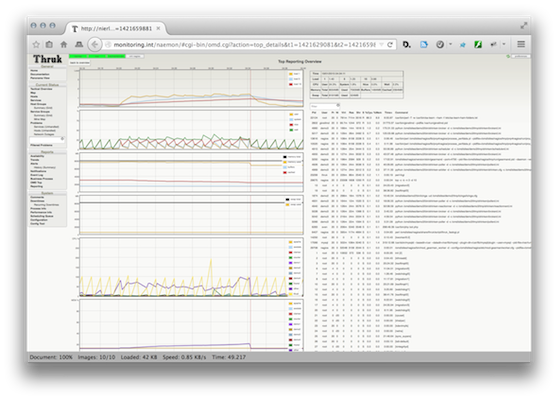

# OMD Thruk Plugin

This plugin saves top data every minute and renders nice graphs to drill down
performance problems on your monitoring host.

## Installation

All steps have to be done as site user

    %> cd etc/thruk/plugins-enabled/
    %> git clone https://github.com/sni/thruk-plugin-omd.git omd
    %> ln -sfn ~/etc/thruk/plugins-enabled/omd/cron ~/etc/cron.d/save_top_data
    %> omd reload crontab
    %> omd reload apache

You now have a new menu item under Reporting -> OMD Top.

In order to put processes into groups, you can define those groups in your
`~/etc/thruk/thruk_local.conf`.

For example:

    omd_top = squid                   = squid
    omd_top = /sbin/httpd2            = apache2
    omd_top = /usr/sbin/mysqld        = mysql
    omd_top = /bin/mod_gearman_worker = mod-gearman

You shouldn't define more than 10 groups, otherwise they won't fit onto
the resulting graph. You have to reload the apache to activate changes
from the `thruk_local.conf`.

## Screenshots

## Usage

The cronjob will collect top data for the last 3 days. On the start page you can select
a time range you want to examine in detail.

On the second page, you can select datapoints to fetch the detailed top data which then
can be sorted by clicking on the table header.

## License

This Addon is licensed under the GPLv3. See the LICENSE file for details.
